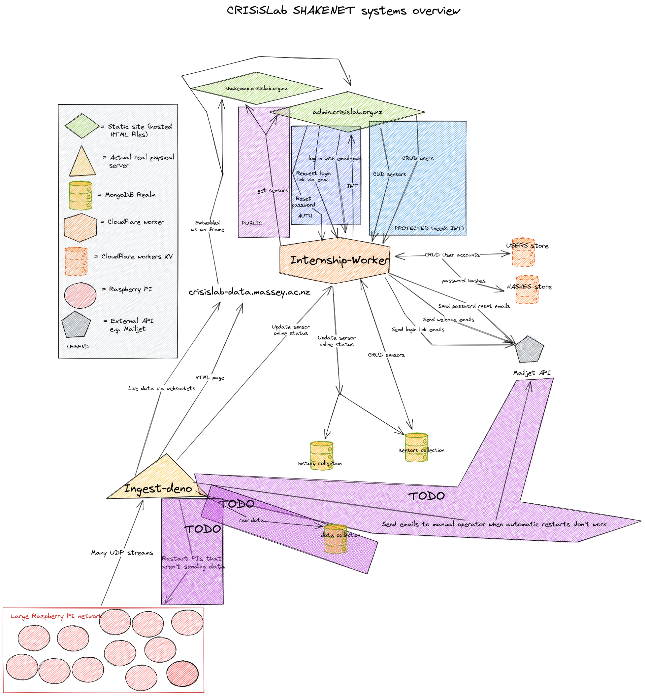

# Ingest Server

This server handles all our data from sensors. It listens to udp packets from the sensor network. It also runs a web server that allows a web client (in `./live-data-graphs`) to connect via websocket to have all of the udp data from a sensor forwarded to it in a format that it can understand. It also saves all of the udp data to a PostgreSQL (+ TimeScale) database. It also hosts an API (/api/v2/\*) for managing sensor metadata, user accounts, etc.

## Usage

To run the server, first install Deno:

```bash
curl -fsSL https://deno.land/x/install/install.sh | sh
```

> Deno v1.39.0 has been tested, no grantees for other versions

Modify the .env file to have an API refresh token & the email associated with it, and the desired ports.

Compile the graphing website:
(this requires NodeJS 20+)

```bash
cd live-data-graphs
npm install
npm run build
```

To start the server

```bash
deno run --allow-ffi --allow-net --allow-read --allow-env --allow-run --allow-sys --unstable-cron src/server.ts
```

You can optionally run it as a service. Make sure to edit the service file to point to the correct directory. Then run:

```bash
git clone https://github.com/rs-Web-Interface-CRISiSLab/ingest-deno.git
sudo cp ingest-deno.service /etc/systemd/system/ingest-deno.service
sudo systemctl daemon-reload
sudo systemctl enable ingest-deno.service
sudo systemctl start ingest-deno.service
```

You may need to install Node.js and npm first.

### Running on Massey VM

For instance:

```bash
sudo systemctl stop ingest-deno
sudo systemctl start ingest-deno
sudo systemctl restart ingest-deno
sudo systemctl status ingest-deno
```

When logged in as a superuser, you can log into the database with:

```bash
psql sensor_data -U postgres -h localhost
```

## Troubleshooting

### Deno was not found

Make sure you have Deno installed and that it is in your PATH. If you're running as root, such as in a service, it will not be in your PATH by default. You can either add it to your PATH or use the absolute path.

### Sensor status is wrong

Make sure you're running only one instance of the server. To temporarily fix the problem, just restart the server.

### The server is not receiving data

This shouldn't be a problem if you're using the correct ports. The firewall is already configured to allow ZeroTier traffic through, but just in case this is the problem, check if you can ping a sensor from the VM.

### The sensors are online, but I can't receive data

This could be an issue with WebSockets being blocked by the Massey reverse proxy. A telltale sign is that the Chrome Devtools network tab shows WebSocket connection is closed immediately after opening, and that it works fine from the browser on the VM. Work with Mike from IT to get this sorted.

### The server is not updating the sensor status

Make sure you're using the correct API token, and that it's not expired. The API endpoint is also configurable in the .env file.

## Network overview diagram


